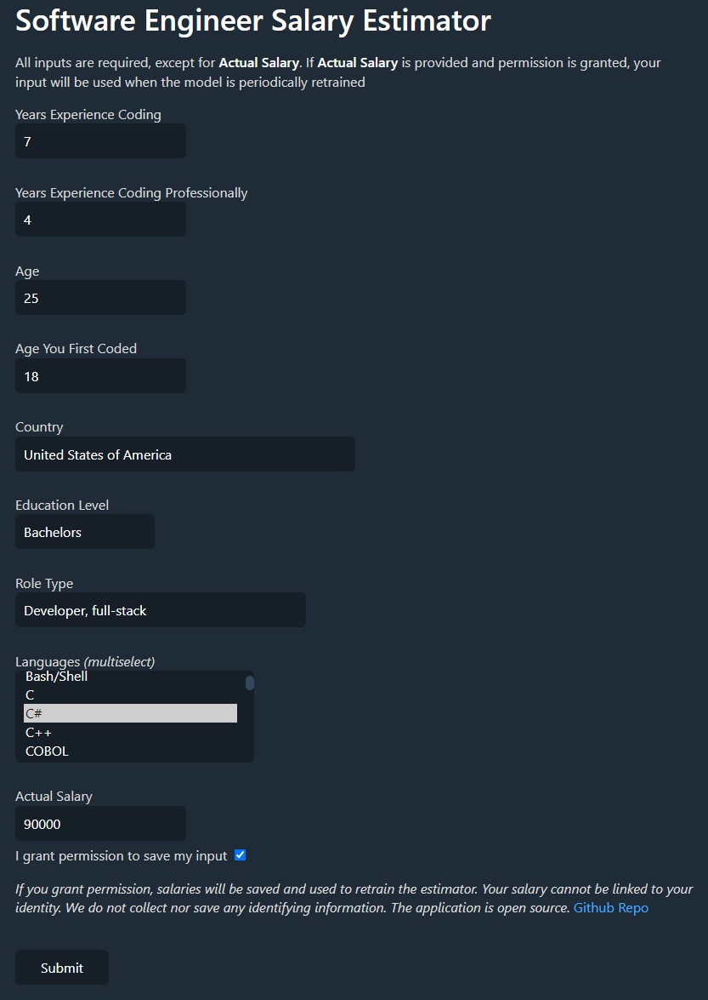

# swe-salary-predictor
A salary predictor for software engineers and other tech roles. Powered by a machine learning model that updates with your input.

##  Repo Overview:
The individual service READMEs have more information concerning local development and deployment.

## docs
Miscellaneous documentation, manual test script

## analytics
Python environment for bulding and testing the model for predicting salaries.

## server
Fastapi server that will store user input into db, get latest model from db, predict salaries using model, and serve results to the users in jinja2 templates.

## database
Postgres database initialized with docker and managed with `alembic`.

## retrainer
Takes the original model and fits additional data to it. Saves the resulting model.

## System Design

## Screenshots
### Form Filled

### Prediction
